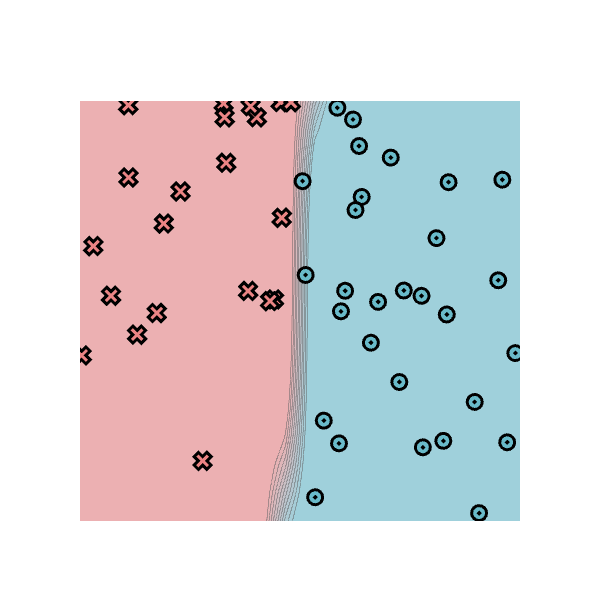
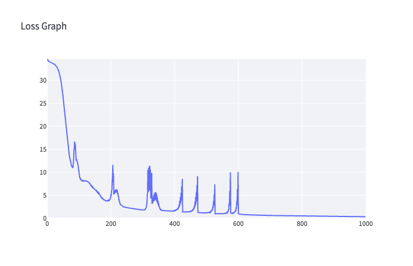
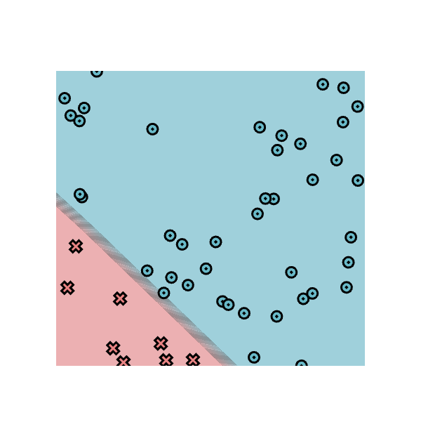
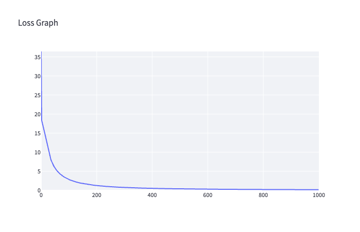
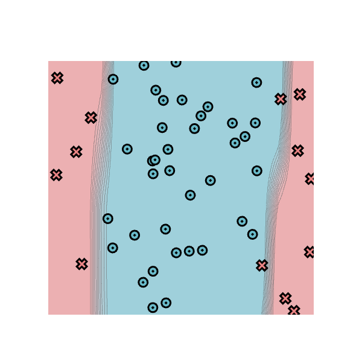
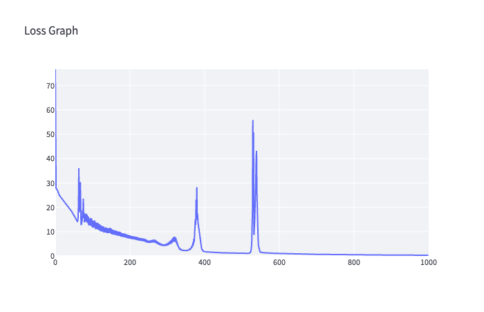
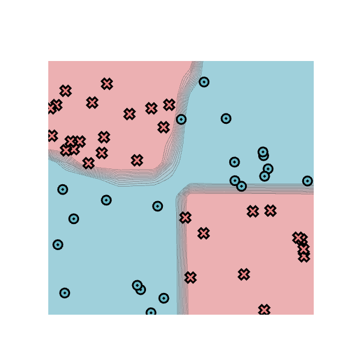
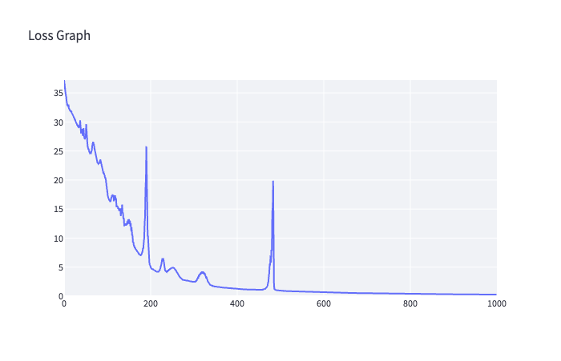

# minitorch
The full minitorch student suite. 


To access the autograder: 

* Module 0: https://classroom.github.com/a/qDYKZff9
* Module 1: https://classroom.github.com/a/6TiImUiy
* Module 2: https://classroom.github.com/a/0ZHJeTA0
* Module 3: https://classroom.github.com/a/U5CMJec1
* Module 4: https://classroom.github.com/a/04QA6HZK
* Quizzes: https://classroom.github.com/a/bGcGc12k

## Task 1.5: Training

| Dataset | Hidden | Rate | Epochs | Final loss | Correct |
|---|---|---|---|---|---|
| Simple | 2 | 0.5 | 1000 | 0.3287 | 50/50 |
| Diag | 5 | 0.5 | 1000 | 0.1651 | 50/50 |
| Split | 10 | 0.5 | 1000 | 0.2913 | 50/50 |
| Xor | 10 | 0.5 | 1000 | 0.2709 | 50/50 |

### Simple

`HIDDEN = 2`, `RATE = 0.5`, `1000` epochs.

 

<details>
<summary>Training log</summary>

```text
Epoch: 10/1000, loss: 33.94369014951406, correct: 29
Epoch: 20/1000, loss: 33.640889573605826, correct: 29
Epoch: 30/1000, loss: 33.02789654764381, correct: 29
Epoch: 40/1000, loss: 31.316632287504323, correct: 29
Epoch: 50/1000, loss: 26.8362337473824, correct: 38
Epoch: 60/1000, loss: 19.71872409464117, correct: 42
Epoch: 70/1000, loss: 13.852293846180194, correct: 46
Epoch: 80/1000, loss: 11.000148337144292, correct: 46
Epoch: 90/1000, loss: 14.269341485672442, correct: 42
Epoch: 100/1000, loss: 10.298002922346893, correct: 44
Epoch: 110/1000, loss: 8.230901392868912, correct: 46
Epoch: 120/1000, loss: 8.14930009499742, correct: 46
Epoch: 130/1000, loss: 7.855486331814212, correct: 46
Epoch: 140/1000, loss: 6.983193849690869, correct: 46
Epoch: 150/1000, loss: 6.215287258843919, correct: 46
Epoch: 160/1000, loss: 5.526023122495578, correct: 47
Epoch: 170/1000, loss: 4.551882665075892, correct: 49
Epoch: 180/1000, loss: 3.94060367044393, correct: 50
Epoch: 190/1000, loss: 3.768137227963176, correct: 50
Epoch: 200/1000, loss: 4.409999739109744, correct: 48
Epoch: 210/1000, loss: 5.171352845120738, correct: 46
Epoch: 220/1000, loss: 5.587504030521148, correct: 46
Epoch: 230/1000, loss: 3.070288709353118, correct: 50
Epoch: 240/1000, loss: 2.4879741176125036, correct: 50
Epoch: 250/1000, loss: 2.3246742817517587, correct: 50
Epoch: 260/1000, loss: 2.1956331497823007, correct: 50
Epoch: 270/1000, loss: 2.080040619842387, correct: 50
Epoch: 280/1000, loss: 1.9752648253882055, correct: 50
Epoch: 290/1000, loss: 1.8803565250464902, correct: 50
Epoch: 300/1000, loss: 1.8025098339531058, correct: 50
Epoch: 310/1000, loss: 2.029321144705446, correct: 50
Epoch: 320/1000, loss: 5.9727841220604505, correct: 46
Epoch: 330/1000, loss: 3.0933563231177366, correct: 50
Epoch: 340/1000, loss: 3.983266160138978, correct: 47
Epoch: 350/1000, loss: 2.7812016772759267, correct: 50
Epoch: 360/1000, loss: 1.7257444405160371, correct: 50
Epoch: 370/1000, loss: 1.5797084887066002, correct: 50
Epoch: 380/1000, loss: 1.530246020849557, correct: 50
Epoch: 390/1000, loss: 1.5249943299862112, correct: 50
Epoch: 400/1000, loss: 1.5944485465997973, correct: 50
Epoch: 410/1000, loss: 1.8450387752186495, correct: 50
Epoch: 420/1000, loss: 3.283565040521831, correct: 48
Epoch: 430/1000, loss: 1.3577187214908342, correct: 50
Epoch: 440/1000, loss: 1.3540583927964671, correct: 50
Epoch: 450/1000, loss: 1.4279211669048506, correct: 50
Epoch: 460/1000, loss: 1.8033161682575425, correct: 50
Epoch: 470/1000, loss: 3.729346330624609, correct: 47
Epoch: 480/1000, loss: 1.1912533575949633, correct: 50
Epoch: 490/1000, loss: 1.1579614790844324, correct: 50
Epoch: 500/1000, loss: 1.1612425415895606, correct: 50
Epoch: 510/1000, loss: 1.2368087951360258, correct: 50
Epoch: 520/1000, loss: 1.803885487141091, correct: 50
Epoch: 530/1000, loss: 0.975977131294218, correct: 50
Epoch: 540/1000, loss: 0.972287523885888, correct: 50
Epoch: 550/1000, loss: 0.9896371387952142, correct: 50
Epoch: 560/1000, loss: 1.078546749795544, correct: 50
Epoch: 570/1000, loss: 1.9583829359383245, correct: 49
Epoch: 580/1000, loss: 1.121495226201758, correct: 49
Epoch: 590/1000, loss: 1.4820344637727085, correct: 49
Epoch: 600/1000, loss: 10.061460436658301, correct: 47
Epoch: 610/1000, loss: 0.8621192785085141, correct: 50
Epoch: 620/1000, loss: 0.7920106617348267, correct: 50
Epoch: 630/1000, loss: 0.7547762487497229, correct: 50
Epoch: 640/1000, loss: 0.7286307043975037, correct: 50
Epoch: 650/1000, loss: 0.7065880958733977, correct: 50
Epoch: 660/1000, loss: 0.6864142493705474, correct: 50
Epoch: 670/1000, loss: 0.6673029527869137, correct: 50
Epoch: 680/1000, loss: 0.6398439398697666, correct: 50
Epoch: 690/1000, loss: 0.6208947142104607, correct: 50
Epoch: 700/1000, loss: 0.6050390929940098, correct: 50
Epoch: 710/1000, loss: 0.5900280706834319, correct: 50
Epoch: 720/1000, loss: 0.5756514032545024, correct: 50
Epoch: 730/1000, loss: 0.5618572729809722, correct: 50
Epoch: 740/1000, loss: 0.5486094485255553, correct: 50
Epoch: 750/1000, loss: 0.5358761555213828, correct: 50
Epoch: 760/1000, loss: 0.52362870303053, correct: 50
Epoch: 770/1000, loss: 0.5118409317302633, correct: 50
Epoch: 780/1000, loss: 0.5004888234824233, correct: 50
Epoch: 790/1000, loss: 0.4895502004388633, correct: 50
Epoch: 800/1000, loss: 0.47900448841391224, correct: 50
Epoch: 810/1000, loss: 0.4688325278804937, correct: 50
Epoch: 820/1000, loss: 0.4590164206219796, correct: 50
Epoch: 830/1000, loss: 0.44953940334232906, correct: 50
Epoch: 840/1000, loss: 0.44038574188288804, correct: 50
Epoch: 850/1000, loss: 0.4315406413824081, correct: 50
Epoch: 860/1000, loss: 0.42299016893519914, correct: 50
Epoch: 870/1000, loss: 0.41472118618399245, correct: 50
Epoch: 880/1000, loss: 0.40672128992453144, correct: 50
Epoch: 890/1000, loss: 0.39897875926591536, correct: 50
Epoch: 900/1000, loss: 0.39148250823309005, correct: 50
Epoch: 910/1000, loss: 0.38422204295003826, correct: 50
Epoch: 920/1000, loss: 0.37718742272924577, correct: 50
Epoch: 930/1000, loss: 0.3703692245326328, correct: 50
Epoch: 940/1000, loss: 0.3637585103742838, correct: 50
Epoch: 950/1000, loss: 0.3573467973149541, correct: 50
Epoch: 960/1000, loss: 0.3511260297596585, correct: 50
Epoch: 970/1000, loss: 0.34508855381672754, correct: 50
Epoch: 980/1000, loss: 0.339227093514122, correct: 50
Epoch: 990/1000, loss: 0.3335358223564002, correct: 50
Epoch: 1000/1000, loss: 0.3286512146029952, correct: 50
```

</details>

### Diag

`HIDDEN = 5`, `RATE = 0.5`, `1000` epochs.

 

<details>
<summary>Training log</summary>

```text
Epoch: 10/1000, loss: 16.307967385151862, correct: 42
Epoch: 20/1000, loss: 13.042103702770712, correct: 42
Epoch: 30/1000, loss: 9.731088727705757, correct: 45
Epoch: 40/1000, loss: 7.337496939581571, correct: 47
Epoch: 50/1000, loss: 5.937625712375311, correct: 49
Epoch: 60/1000, loss: 4.978227577513034, correct: 50
Epoch: 70/1000, loss: 4.2448595220869185, correct: 50
Epoch: 80/1000, loss: 3.694701362641845, correct: 50
Epoch: 90/1000, loss: 3.239004785563256, correct: 50
Epoch: 100/1000, loss: 2.876596906062922, correct: 50
Epoch: 110/1000, loss: 2.5721577818488703, correct: 50
Epoch: 120/1000, loss: 2.337037736740705, correct: 50
Epoch: 130/1000, loss: 2.1202626187421414, correct: 50
Epoch: 140/1000, loss: 1.9411510619812136, correct: 50
Epoch: 150/1000, loss: 1.789316581084477, correct: 50
Epoch: 160/1000, loss: 1.6570628267182095, correct: 50
Epoch: 170/1000, loss: 1.5401173847292435, correct: 50
Epoch: 180/1000, loss: 1.4358315389138971, correct: 50
Epoch: 190/1000, loss: 1.3428927864626738, correct: 50
Epoch: 200/1000, loss: 1.2598745669288816, correct: 50
Epoch: 210/1000, loss: 1.1851999421637471, correct: 50
Epoch: 220/1000, loss: 1.116950103856423, correct: 50
Epoch: 230/1000, loss: 1.05589277496461, correct: 50
Epoch: 240/1000, loss: 0.9997213840089081, correct: 50
Epoch: 250/1000, loss: 0.9488753095624058, correct: 50
Epoch: 260/1000, loss: 0.9022322223758312, correct: 50
Epoch: 270/1000, loss: 0.8592740246235814, correct: 50
Epoch: 280/1000, loss: 0.8197748577801542, correct: 50
Epoch: 290/1000, loss: 0.78335675539289, correct: 50
Epoch: 300/1000, loss: 0.7496961226946434, correct: 50
Epoch: 310/1000, loss: 0.7185085919036927, correct: 50
Epoch: 320/1000, loss: 0.6895464716659123, correct: 50
Epoch: 330/1000, loss: 0.6625930529722679, correct: 50
Epoch: 340/1000, loss: 0.6374586072130362, correct: 50
Epoch: 350/1000, loss: 0.6139749991978974, correct: 50
Epoch: 360/1000, loss: 0.5919946206161182, correct: 50
Epoch: 370/1000, loss: 0.5712930479104107, correct: 50
Epoch: 380/1000, loss: 0.5518896029414372, correct: 50
Epoch: 390/1000, loss: 0.5336920327571403, correct: 50
Epoch: 400/1000, loss: 0.5164817108660391, correct: 50
Epoch: 410/1000, loss: 0.5002668169604496, correct: 50
Epoch: 420/1000, loss: 0.48499051360514756, correct: 50
Epoch: 430/1000, loss: 0.47044914661805365, correct: 50
Epoch: 440/1000, loss: 0.4567689477806999, correct: 50
Epoch: 450/1000, loss: 0.44371648480696213, correct: 50
Epoch: 460/1000, loss: 0.43140344558133237, correct: 50
Epoch: 470/1000, loss: 0.41963549197447475, correct: 50
Epoch: 480/1000, loss: 0.40843919278534424, correct: 50
Epoch: 490/1000, loss: 0.39783774235590863, correct: 50
Epoch: 500/1000, loss: 0.38767570294918263, correct: 50
Epoch: 510/1000, loss: 0.37798606469616886, correct: 50
Epoch: 520/1000, loss: 0.3687713658786691, correct: 50
Epoch: 530/1000, loss: 0.35992385802227506, correct: 50
Epoch: 540/1000, loss: 0.3514643771444881, correct: 50
Epoch: 550/1000, loss: 0.34337257559958556, correct: 50
Epoch: 560/1000, loss: 0.33562714246057096, correct: 50
Epoch: 570/1000, loss: 0.32817920454131555, correct: 50
Epoch: 580/1000, loss: 0.32103265172500023, correct: 50
Epoch: 590/1000, loss: 0.31419234014462066, correct: 50
Epoch: 600/1000, loss: 0.30771215328812335, correct: 50
Epoch: 610/1000, loss: 0.3012668647752698, correct: 50
Epoch: 620/1000, loss: 0.2952112927885236, correct: 50
Epoch: 630/1000, loss: 0.2893516523127902, correct: 50
Epoch: 640/1000, loss: 0.28442746669916374, correct: 50
Epoch: 650/1000, loss: 0.2782867505235712, correct: 50
Epoch: 660/1000, loss: 0.27305919357798913, correct: 50
Epoch: 670/1000, loss: 0.2680055738608455, correct: 50
Epoch: 680/1000, loss: 0.26486343082777386, correct: 50
Epoch: 690/1000, loss: 0.258427392772908, correct: 50
Epoch: 700/1000, loss: 0.25409456903627603, correct: 50
Epoch: 710/1000, loss: 0.24990588862603208, correct: 50
Epoch: 720/1000, loss: 0.24532421746024588, correct: 50
Epoch: 730/1000, loss: 0.24318187573339733, correct: 50
Epoch: 740/1000, loss: 0.23878935714052718, correct: 50
Epoch: 750/1000, loss: 0.2334702315632144, correct: 50
Epoch: 760/1000, loss: 0.22965460698345402, correct: 50
Epoch: 770/1000, loss: 0.22595683231376879, correct: 50
Epoch: 780/1000, loss: 0.22266498567700982, correct: 50
Epoch: 790/1000, loss: 0.21902986716043987, correct: 50
Epoch: 800/1000, loss: 0.21594485372315272, correct: 50
Epoch: 810/1000, loss: 0.21292398626876793, correct: 50
Epoch: 820/1000, loss: 0.21069773462810518, correct: 50
Epoch: 830/1000, loss: 0.2064007394116226, correct: 50
Epoch: 840/1000, loss: 0.20499305048965802, correct: 50
Epoch: 850/1000, loss: 0.20053586122052253, correct: 50
Epoch: 860/1000, loss: 0.19918708626317827, correct: 50
Epoch: 870/1000, loss: 0.19536911485985015, correct: 50
Epoch: 880/1000, loss: 0.19274560665620177, correct: 50
Epoch: 890/1000, loss: 0.1910195130996308, correct: 50
Epoch: 900/1000, loss: 0.18714796554463797, correct: 50
Epoch: 910/1000, loss: 0.18471425898086974, correct: 50
Epoch: 920/1000, loss: 0.1828457453804328, correct: 50
Epoch: 930/1000, loss: 0.17995120548679006, correct: 50
Epoch: 940/1000, loss: 0.1787620991460454, correct: 50
Epoch: 950/1000, loss: 0.17650712529222184, correct: 50
Epoch: 960/1000, loss: 0.1742984494894078, correct: 50
Epoch: 970/1000, loss: 0.17228740270473059, correct: 50
Epoch: 980/1000, loss: 0.1692218946675815, correct: 50
Epoch: 990/1000, loss: 0.16702870698441036, correct: 50
Epoch: 1000/1000, loss: 0.16509074417541786, correct: 50
```

</details>

### Split

`HIDDEN = 10`, `RATE = 0.5`, `1000` epochs.

 

<details>
<summary>Training log</summary>

```text
Epoch: 10/1000, loss: 25.483699101032105, correct: 41
Epoch: 20/1000, loss: 23.417787265338195, correct: 43
Epoch: 30/1000, loss: 21.591444232604722, correct: 43
Epoch: 40/1000, loss: 19.460757395217072, correct: 43
Epoch: 50/1000, loss: 16.91865345100944, correct: 44
Epoch: 60/1000, loss: 14.202658723390323, correct: 44
Epoch: 70/1000, loss: 12.933257062837091, correct: 45
Epoch: 80/1000, loss: 16.22931796321723, correct: 44
Epoch: 90/1000, loss: 16.0195626139958, correct: 44
Epoch: 100/1000, loss: 14.684154055922393, correct: 45
Epoch: 110/1000, loss: 13.557819028438894, correct: 46
Epoch: 120/1000, loss: 12.913746264130456, correct: 46
Epoch: 130/1000, loss: 12.083608632110202, correct: 46
Epoch: 140/1000, loss: 11.446334580878725, correct: 46
Epoch: 150/1000, loss: 11.324217108707927, correct: 46
Epoch: 160/1000, loss: 10.489007913908202, correct: 46
Epoch: 170/1000, loss: 10.044333717633327, correct: 46
Epoch: 180/1000, loss: 9.360689348193318, correct: 46
Epoch: 190/1000, loss: 8.94288819502794, correct: 46
Epoch: 200/1000, loss: 8.487650011583984, correct: 46
Epoch: 210/1000, loss: 8.029336611799932, correct: 47
Epoch: 220/1000, loss: 7.692648888529351, correct: 47
Epoch: 230/1000, loss: 7.3363989440985, correct: 47
Epoch: 240/1000, loss: 7.012927040959033, correct: 47
Epoch: 250/1000, loss: 6.329727274354021, correct: 47
Epoch: 260/1000, loss: 6.572132983335354, correct: 47
Epoch: 270/1000, loss: 6.444977576422273, correct: 47
Epoch: 280/1000, loss: 5.349602383733576, correct: 48
Epoch: 290/1000, loss: 4.771421940569741, correct: 48
Epoch: 300/1000, loss: 5.110553707197838, correct: 48
Epoch: 310/1000, loss: 6.340557565769889, correct: 48
Epoch: 320/1000, loss: 7.908831902692836, correct: 47
Epoch: 330/1000, loss: 4.398248806468855, correct: 48
Epoch: 340/1000, loss: 2.4954808961142634, correct: 49
Epoch: 350/1000, loss: 2.2656775892044076, correct: 49
Epoch: 360/1000, loss: 2.6837676450022148, correct: 48
Epoch: 370/1000, loss: 5.640423706723794, correct: 48
Epoch: 380/1000, loss: 28.284399937671893, correct: 41
Epoch: 390/1000, loss: 6.25473004846373, correct: 47
Epoch: 400/1000, loss: 1.8111667713606403, correct: 50
Epoch: 410/1000, loss: 1.622630390349185, correct: 50
Epoch: 420/1000, loss: 1.5153314154212805, correct: 50
Epoch: 430/1000, loss: 1.425510435181368, correct: 50
Epoch: 440/1000, loss: 1.3461630564172173, correct: 50
Epoch: 450/1000, loss: 1.2749260891194119, correct: 50
Epoch: 460/1000, loss: 1.2103657423799699, correct: 50
Epoch: 470/1000, loss: 1.1515709633296507, correct: 50
Epoch: 480/1000, loss: 1.0976929328425693, correct: 50
Epoch: 490/1000, loss: 1.048508004803598, correct: 50
Epoch: 500/1000, loss: 1.0054697905920051, correct: 50
Epoch: 510/1000, loss: 0.9828064121016762, correct: 50
Epoch: 520/1000, loss: 1.1068234617897297, correct: 50
Epoch: 530/1000, loss: 55.81489106664863, correct: 41
Epoch: 540/1000, loss: 43.20746575751429, correct: 39
Epoch: 550/1000, loss: 1.6006170715322996, correct: 50
Epoch: 560/1000, loss: 1.3141296533619016, correct: 50
Epoch: 570/1000, loss: 1.2021584068864104, correct: 50
Epoch: 580/1000, loss: 1.1287059732398637, correct: 50
Epoch: 590/1000, loss: 1.0666057999393501, correct: 50
Epoch: 600/1000, loss: 1.011964943002492, correct: 50
Epoch: 610/1000, loss: 0.9630537317882351, correct: 50
Epoch: 620/1000, loss: 0.9185399609928091, correct: 50
Epoch: 630/1000, loss: 0.8777184044587049, correct: 50
Epoch: 640/1000, loss: 0.8400248367118254, correct: 50
Epoch: 650/1000, loss: 0.8051401754165947, correct: 50
Epoch: 660/1000, loss: 0.7727105054895697, correct: 50
Epoch: 670/1000, loss: 0.7424636295043868, correct: 50
Epoch: 680/1000, loss: 0.714191146960361, correct: 50
Epoch: 690/1000, loss: 0.6877454823765042, correct: 50
Epoch: 700/1000, loss: 0.6628691029932492, correct: 50
Epoch: 710/1000, loss: 0.6394760631244453, correct: 50
Epoch: 720/1000, loss: 0.6174580193366337, correct: 50
Epoch: 730/1000, loss: 0.5966696791168408, correct: 50
Epoch: 740/1000, loss: 0.5770165438097614, correct: 50
Epoch: 750/1000, loss: 0.5584078089745963, correct: 50
Epoch: 760/1000, loss: 0.5407899699650951, correct: 50
Epoch: 770/1000, loss: 0.5240614708106516, correct: 50
Epoch: 780/1000, loss: 0.5081749571688167, correct: 50
Epoch: 790/1000, loss: 0.4930571378712908, correct: 50
Epoch: 800/1000, loss: 0.47868759405521166, correct: 50
Epoch: 810/1000, loss: 0.46499706099950294, correct: 50
Epoch: 820/1000, loss: 0.4519141505718906, correct: 50
Epoch: 830/1000, loss: 0.4394569767001685, correct: 50
Epoch: 840/1000, loss: 0.42753826337187306, correct: 50
Epoch: 850/1000, loss: 0.4161562072782886, correct: 50
Epoch: 860/1000, loss: 0.4052441971894183, correct: 50
Epoch: 870/1000, loss: 0.3948215670158555, correct: 50
Epoch: 880/1000, loss: 0.38482123569402643, correct: 50
Epoch: 890/1000, loss: 0.3752266367045627, correct: 50
Epoch: 900/1000, loss: 0.3660276735008677, correct: 50
Epoch: 910/1000, loss: 0.35720035729000343, correct: 50
Epoch: 920/1000, loss: 0.34870294237742294, correct: 50
Epoch: 930/1000, loss: 0.3405494362477171, correct: 50
Epoch: 940/1000, loss: 0.33269827991790074, correct: 50
Epoch: 950/1000, loss: 0.32514692709804716, correct: 50
Epoch: 960/1000, loss: 0.3178774324130427, correct: 50
Epoch: 970/1000, loss: 0.3108681420940774, correct: 50
Epoch: 980/1000, loss: 0.30411555944023716, correct: 50
Epoch: 990/1000, loss: 0.29760157265826864, correct: 50
Epoch: 1000/1000, loss: 0.2913138288574847, correct: 50
```

</details>

### Xor

`HIDDEN = 10`, `RATE = 0.5`, `1000` epochs.

 

<details>
<summary>Training log</summary>

```text
Epoch: 10/1000, loss: 32.96927475146745, correct: 32
Epoch: 20/1000, loss: 31.39702435955991, correct: 35
Epoch: 30/1000, loss: 29.743675962261452, correct: 36
Epoch: 40/1000, loss: 28.15936573376869, correct: 36
Epoch: 50/1000, loss: 27.48933900466882, correct: 36
Epoch: 60/1000, loss: 24.561749391837008, correct: 37
Epoch: 70/1000, loss: 26.077111145133593, correct: 34
Epoch: 80/1000, loss: 22.78668201921218, correct: 36
Epoch: 90/1000, loss: 21.6430434105463, correct: 37
Epoch: 100/1000, loss: 18.196678793071623, correct: 42
Epoch: 110/1000, loss: 17.207777583390467, correct: 42
Epoch: 120/1000, loss: 16.558017671127192, correct: 41
Epoch: 130/1000, loss: 14.672401367083943, correct: 42
Epoch: 140/1000, loss: 12.041002112111856, correct: 43
Epoch: 150/1000, loss: 12.593937975911937, correct: 45
Epoch: 160/1000, loss: 9.269949721322037, correct: 46
Epoch: 170/1000, loss: 7.68575295138323, correct: 48
Epoch: 180/1000, loss: 7.205670319902329, correct: 48
Epoch: 190/1000, loss: 20.18743154401165, correct: 42
Epoch: 200/1000, loss: 5.050627291668773, correct: 50
Epoch: 210/1000, loss: 4.3804887964727754, correct: 50
Epoch: 220/1000, loss: 4.312670769931142, correct: 49
Epoch: 230/1000, loss: 6.515841615147533, correct: 46
Epoch: 240/1000, loss: 4.270928447731105, correct: 49
Epoch: 250/1000, loss: 4.849073017255401, correct: 48
Epoch: 260/1000, loss: 4.313691244131824, correct: 48
Epoch: 270/1000, loss: 3.1569067607667773, correct: 49
Epoch: 280/1000, loss: 2.75953807628958, correct: 49
Epoch: 290/1000, loss: 2.6194409898620363, correct: 49
Epoch: 300/1000, loss: 2.472680737150527, correct: 49
Epoch: 310/1000, loss: 3.1918143935993397, correct: 49
Epoch: 320/1000, loss: 4.243356889460974, correct: 48
Epoch: 330/1000, loss: 3.2290081002157196, correct: 49
Epoch: 340/1000, loss: 1.8967303111522622, correct: 50
Epoch: 350/1000, loss: 1.6470297121529396, correct: 50
Epoch: 360/1000, loss: 1.544159013628229, correct: 50
Epoch: 370/1000, loss: 1.4623543158301053, correct: 50
Epoch: 380/1000, loss: 1.3887868187046088, correct: 50
Epoch: 390/1000, loss: 1.3227902129786464, correct: 50
Epoch: 400/1000, loss: 1.2632535257116875, correct: 50
Epoch: 410/1000, loss: 1.2085897622095652, correct: 50
Epoch: 420/1000, loss: 1.157118168588612, correct: 50
Epoch: 430/1000, loss: 1.109876556446793, correct: 50
Epoch: 440/1000, loss: 1.0680225963588077, correct: 50
Epoch: 450/1000, loss: 1.059404948531949, correct: 50
Epoch: 460/1000, loss: 1.120546586454728, correct: 50
Epoch: 470/1000, loss: 1.6819632433791367, correct: 49
Epoch: 480/1000, loss: 8.030751437311658, correct: 47
Epoch: 490/1000, loss: 1.059511521904723, correct: 50
Epoch: 500/1000, loss: 0.9432730450768272, correct: 50
Epoch: 510/1000, loss: 0.8911503808213243, correct: 50
Epoch: 520/1000, loss: 0.8514861638448789, correct: 50
Epoch: 530/1000, loss: 0.8244263740701231, correct: 50
Epoch: 540/1000, loss: 0.7924093776988294, correct: 50
Epoch: 550/1000, loss: 0.7650070343389226, correct: 50
Epoch: 560/1000, loss: 0.7387179233007471, correct: 50
Epoch: 570/1000, loss: 0.7156955675171496, correct: 50
Epoch: 580/1000, loss: 0.6940647042202751, correct: 50
Epoch: 590/1000, loss: 0.6735735541642399, correct: 50
Epoch: 600/1000, loss: 0.6541013822210437, correct: 50
Epoch: 610/1000, loss: 0.6355571715554541, correct: 50
Epoch: 620/1000, loss: 0.6178672894641258, correct: 50
Epoch: 630/1000, loss: 0.6009731238239828, correct: 50
Epoch: 640/1000, loss: 0.5848117707561475, correct: 50
Epoch: 650/1000, loss: 0.5693387609887962, correct: 50
Epoch: 660/1000, loss: 0.5545104511000735, correct: 50
Epoch: 670/1000, loss: 0.540288966701615, correct: 50
Epoch: 680/1000, loss: 0.5266428744011769, correct: 50
Epoch: 690/1000, loss: 0.5135358718371326, correct: 50
Epoch: 700/1000, loss: 0.5009367544741054, correct: 50
Epoch: 710/1000, loss: 0.4888234862010682, correct: 50
Epoch: 720/1000, loss: 0.4771675532993471, correct: 50
Epoch: 730/1000, loss: 0.46594355914612084, correct: 50
Epoch: 740/1000, loss: 0.4551332971866852, correct: 50
Epoch: 750/1000, loss: 0.4447089236015114, correct: 50
Epoch: 760/1000, loss: 0.4346674058015953, correct: 50
Epoch: 770/1000, loss: 0.42497563247193965, correct: 50
Epoch: 780/1000, loss: 0.41562155171788834, correct: 50
Epoch: 790/1000, loss: 0.4065896583293316, correct: 50
Epoch: 800/1000, loss: 0.3978616377039893, correct: 50
Epoch: 810/1000, loss: 0.3894269353484626, correct: 50
Epoch: 820/1000, loss: 0.3812700342354368, correct: 50
Epoch: 830/1000, loss: 0.37338178163191627, correct: 50
Epoch: 840/1000, loss: 0.36574847482044076, correct: 50
Epoch: 850/1000, loss: 0.35835884478899094, correct: 50
Epoch: 860/1000, loss: 0.35120570283260516, correct: 50
Epoch: 870/1000, loss: 0.34427473987623697, correct: 50
Epoch: 880/1000, loss: 0.3375587773097192, correct: 50
Epoch: 890/1000, loss: 0.3310498293994014, correct: 50
Epoch: 900/1000, loss: 0.3247392262492883, correct: 50
Epoch: 910/1000, loss: 0.318616419066105, correct: 50
Epoch: 920/1000, loss: 0.31267700680642024, correct: 50
Epoch: 930/1000, loss: 0.3069128251986224, correct: 50
Epoch: 940/1000, loss: 0.30131869436088377, correct: 50
Epoch: 950/1000, loss: 0.29588429991392207, correct: 50
Epoch: 960/1000, loss: 0.29060329788894806, correct: 50
Epoch: 970/1000, loss: 0.2854739665019868, correct: 50
Epoch: 980/1000, loss: 0.28048931654047954, correct: 50
Epoch: 990/1000, loss: 0.27564249900436694, correct: 50
Epoch: 1000/1000, loss: 0.27092954108999096, correct: 50
```

</details>
